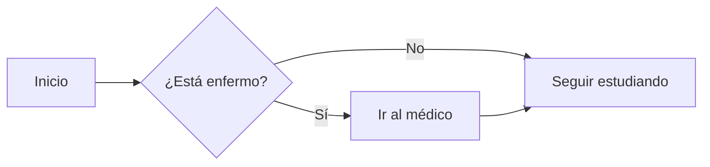

import { Callout } from 'fumadocs-ui/components/callout';
import { Cards, Card } from 'fumadocs-ui/components/card';
import { File, Sparkles, BookOpen, AlertTriangle } from 'lucide-react';

Esta página demuestra todas las capacidades de tu nuevo blog.

## 🚀 Componentes UI de Fumadocs

Estas características son exclusivas de Fumadocs y hacen que tu sitio destaque.

### Tarjetas (Cards)
Ideales para enlaces destacados o agrupar conceptos.

<Cards>
  <Card
    href="/medicina/introduccion"
    title="Ir a Introducción"
    icon={<File />}
    description="Vuelve al inicio de los apuntes"
  />
  <Card
    href="https://fumadocs.vercel.app"
    title="Documentación Oficial"
    icon={<BookOpen />}
    description="Aprende más sobre Fumadocs"
    external
  />
</Cards>

### Alertas (Callouts)
Usa esto para resaltar información crítica.

<Callout title="Nota">
  Información por defecto. Útil para notas al margen.
</Callout>

<Callout type="info" title="Dato Curioso">
  ¿Sabías que Fumadocs usa Next.js bajo el capó?
</Callout>

<Callout type="warn" title="Precaución">
  Ten cuidado al modificar archivos de configuración.
</Callout>

<Callout type="error" title="Peligro">
  Esto es un error crítico o algo que el usuario no debe hacer.
</Callout>

---

## 💻 Bloques de Código Avanzados

Fumadocs lleva los bloques de código al siguiente nivel.

### Títulos y Números de Línea
Añade `title="Nombre"` y `lineNumbers`.

```js title="calculo.js" lineNumbers
const suma = (a, b) => {
  return a + b;
}
console.log(suma(2, 2));
```

### Resaltado y Diffs
Puedes resaltar líneas o mostrar cambios (como en Git) directamente en el código.

```ts title="diff-ejemplo.ts"
// [!code word:console]
// [!code word:log]
function demo() {
  console.log('Esta línea se queda igual'); 
  console.log('Esta línea se borrará'); // [!code --]
  console.log('Esta línea es nueva'); // [!code ++]
  
  // ¡Mira cómo resalta la siguiente línea!
  return "Resultado importante"; // [!code highlight]
}
```

### Pestañas de Código (Tabs)
Perfecto para mostrar el mismo código en varios lenguajes.

```js tab="JavaScript"
console.log('Hola Mundo');
```

```python tab="Python"
print('Hola Mundo')
```

### Comandos de Instalación
Usa el lenguaje `npm` para generar pestañas de instalación automáticas.

```npm
npm install fumadocs-ui
```

---

## 📝 Markdown Estándar

### Estilos de Texto

| Estilo | Sintaxis | Resultado |
| :--- | :--- | :--- |
| Negrita | `**texto**` | **texto** |
| Cursiva | `*texto*` | *texto* |
| Tachado | `~~texto~~` | ~~texto~~ |
| Código | `` `código` `` | `código` |
| Subíndice | `<sub>texto</sub>` | <sub>texto</sub> |
| Superíndice | `<sup>texto</sup>` | <sup>texto</sup> |

### Citas

> "No comuniques compartiendo memoria, comparte memoria comunicando."
> — <cite>Rob Pike</cite>

### Listas

#### Lista de Tareas
- [x] Aprender Markdown
- [x] Configurar Fumadocs
- [ ] Escribir primer artículo

---

## 🧠 Ciencia y Diagramas

### Matemáticas (KaTeX)
Ecuaciones renderizadas perfectamente.

En línea: $E = mc^2$

Bloque:
$$
TFG = \frac{(140 - \text{edad}) \times \text{peso}}{72 \times \text{CrS}} \times (0.85 \text{ si mujer})
$$

### Diagramas (Mermaid)
Diagramas de flujo generados desde código.



---

## ⚓ Control de Tabla de Contenidos (TOC)

Puedes controlar si un título aparece en la barra lateral derecha.

### Este título está oculto en el TOC [!toc]
(No aparecerá a la derecha)

### Este título es normal
(Sí aparecerá a la derecha)