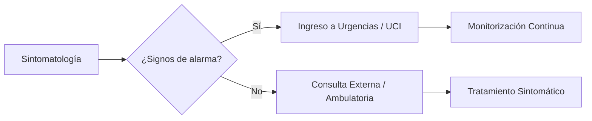

import { Callout } from 'fumadocs-ui/components/callout';
import { Cards, Card } from 'fumadocs-ui/components/card';
import { Accordion, Accordions } from 'fumadocs-ui/components/accordion';
import { Tab, Tabs } from 'fumadocs-ui/components/tabs';
import { TypeTable } from 'fumadocs-ui/components/type-table';
import { File, BookOpen } from 'lucide-react';

Esta página demuestra todas las capacidades técnicas, visuales y tipográficas de Taimilog, renderizadas bajo la máxima legibilidad de **Atkinson Hyperlegible**.

---

## 🚀 Componentes UI de Fumadocs

Estas características son nativas del framework y permiten estructurar información densa sin abrumar al lector.

### Tarjetas (Cards)
Ideales para enlaces destacados, agrupar conceptos médicos o navegar entre módulos.

<Cards>
  <Card
    href="/medicina/introduccion"
    title="Ir a Introducción"
    icon={<File />}
    description="Vuelve al inicio de los apuntes clínicos"
  />
  <Card
    href="https://fumadocs.vercel.app"
    title="Documentación Oficial"
    icon={<BookOpen />}
    description="Aprende más sobre el ecosistema de Fumadocs"
    external
  />
</Cards>

### Alertas (Callouts)
Usa cajas de atención para resaltar perlas clínicas, advertencias farmacológicas o ideas clave.

<Callout title="Nota Marginal">
  Información por defecto. Útil para bibliografía o contexto histórico breve.
</Callout>

<Callout type="info" title="Dato Curioso">
  ¿Sabías que nuestra tipografía diferencia perfectamente la **I** mayúscula, la **l** minúscula y el número **1** para evitar errores médicos de lectura?
</Callout>

<Callout type="idea" title="Perla Clínica">
  El tipo idea es excelente para trucos mnemotécnicos o diagnósticos diferenciales rápidos.
</Callout>

<Callout type="warn" title="Precaución">
  Monitorear niveles renales antes de administrar medios de contraste.
</Callout>

<Callout type="error" title="Contraindicación Absoluta">
  No combinar este fármaco con inhibidores de la monoaminooxidasa (IMAO).
</Callout>

### Acordeones (Accordions)
Perfectos para ocultar fisiopatología extensa, resoluciones de casos clínicos o preguntas frecuentes.

<Accordions type="single">
  <Accordion title="¿Cómo se calcula la Tasa de Filtración Glomerular?" id="tfg-faq">
    Se puede estimar de forma rápida en la cama del paciente usando la fórmula de **Cockcroft-Gault**, aunque actualmente se prefieren ecuaciones basadas en cistatina C o CKD-EPI para mayor precisión.
  </Accordion>
  <Accordion title="Ver diagnóstico diferencial completo" id="ddx-faq">
    * Infarto agudo de miocardio (IAM)
    * Tromboembolia pulmonar (TEP)
    * Disección aórtica
    * Neumotórax a tensión
  </Accordion>
</Accordions>

### Pestañas Visuales (Tabs UI)
Para comparar guías de tratamiento según la región o evolucionar un caso clínico por etapas.

<Tabs items={['Guía AHA/ACC (USA)', 'Guía ESC (Europa)']} updateAnchor>
  <Tab id="guia-usa" value="Guía AHA/ACC (USA)">
    Recomienda iniciar terapia con estatinas de alta intensidad si el riesgo cardiovascular a 10 años es **mayor a 7.5%**.
  </Tab>
  <Tab id="guia-esc" value="Guía ESC (Europa)">
    Utiliza las tablas SCORE2 y SCORE2-OP para categorizar el riesgo según la región epidemiológica europea.
  </Tab>
</Tabs>

### Tablas de Tipos (TypeTable)
Reemplaza las tablas de Markdown abrumadoras cuando necesites documentar parámetros, dosis farmacológicas o estructuras de datos.

<TypeTable
  type={{
    dosis_maxima: {
      description: 'Dosis tope ponderada por kilogramo al día.',
      type: 'number',
      default: '40 mg/kg',
    },
    via_administracion: {
      description: 'Rutas aprobadas para infusión en urgencias.',
      type: 'string',
      default: "'IV' | 'VO' | 'IM'",
    },
    ajuste_renal: {
      description: '¿Requiere reducir la dosis si el ClCr es menor a 30 mL/min?',
      type: 'boolean',
      default: 'true',
    },
  }}
/>

---

## 📋 Guías Paso a Paso (Cronologías)

Al añadir el modificador `[step]` a los encabezados H3, Fumadocs dibuja automáticamente una línea de tiempo conectada. Es inmejorable para protocolos de soporte vital (RCP), tutoriales o vías clínicas.

### Evaluar nivel de consciencia y pulso [step]
Verificar si el paciente responde y comprobar el pulso carotídeo en no más de 10 segundos.

### Iniciar compresiones torácicas [step]
Compresiones de alta calidad a un ritmo de 100-120 por minuto, con una profundidad de al menos 5 cm en adultos.

### Conectar el desfibrilador (DEA) [step]
Aplicar parches e interrumpir compresiones únicamente mientras el dispositivo analiza el ritmo cardiaco.

---

## 💻 Bloques de Código Shiki Avanzados

### Títulos, Números de Línea y Diffs
Añade `title="Nombre"` y `lineNumbers`. Puedes resaltar líneas o mostrar cambios de Git en vivo.

```ts title="dosis_calc.ts" lineNumbers=1
// [!code word:console]
// [!code word:alert]
function calcularInfusion(peso: number, dosis: number): number {
  console.log('Calculando parámetros vitales...'); 
  alert('Dosis antigua anticuada'); // [!code --]
  console.log('Aplicando protocolo actualizado 2026'); // [!code ++]
  
  // ¡Mira cómo resalta la línea de retorno clínico!
  return (peso * dosis) / 24; // [!code highlight]
}
```

### Pestañas Sincronizadas con Persistencia (`tab-group`)
Al usar `tab-group="id"`, el navegador recordará el lenguaje favorito del lector en toda la web.

```ts tab="TypeScript" tab-group="lenguaje"
const paciente: string = "Juan Pérez";
```

```python tab="Python"
paciente: str = "Juan Pérez"
```

### Comandos de Instalación (Multi-Gestor)
El bloque de código con lenguaje `npm` genera 4 pestañas automáticas para instalar librerías.

```npm
npm install d3 @types/d3 mermaid
```

---

## 📝 Markdown Estándar y Tipografía

Gracias a nuestra configuración, el texto se renderiza en **Atkinson Hyperlegible**, blindando la legibilidad en pantallas OLED y sesiones de estudio nocturnas.

### Estilos de Texto

| Estilo | Sintaxis | Resultado |
| :--- | :--- | :--- |
| Negrita | `**texto**` | **texto** |
| Cursiva | `*texto*` | *texto* |
| Tachado | `~~texto~~` | ~~texto~~ |
| Código | `` `código` `` | `código` |
| Subíndice | `H<sub>2</sub>O` | H<sub>2</sub>O |
| Superíndice | `Ca<sup>2+</sup>` | Ca<sup>2+</sup> |

### Citas Limpias (Sin comillas duplicadas)

> El médico que sólo sabe medicina, ni medicina sabe.

— **José Letamendi**

---

## 🧠 Ciencia, Matemáticas y Visualizaciones (Los Tres Elefantes)

Nuestra hoja de estilos global (`global.css`) maneja estos tres potentes motores de renderizado en completa armonía:

### 1. Matemáticas (KaTeX)
<Callout title="Protección Tipográfica" type="info">
  KaTeX conserva intacta su tipografía **Serif matemática formal** por diseño. Nuestro CSS impide que la tipografía general de la web altere la alineación de fracciones o superíndices.
</Callout>

En línea: La fórmula de Einstein $E = mc^2$ o el cálculo algebraico: $pH = pK_a + \log([A^-]/[HA])$.

Bloque (Fórmula de Depuración de Creatinina):
$$
\text{CrCl} = \frac{(140 - \text{edad}) \times \text{peso en kg}}{72 \times \text{CrS mg/dL}} \times (0.85 \text{ si es mujer})
$$

### 2. Diagramas de Flujo (Mermaid)
<Callout title="Herencia Tipográfica Activa" type="info">
  A diferencia de KaTeX, los diagramas de Mermaid absorben automáticamente **Atkinson Hyperlegible** (`var(--font-sans)`) en sus flechas y nodos gracias a nuestro blindaje en `global.css`.
</Callout>



### 3. Visualizaciones D3.js (Lienzos Vectoriales)
Cuando integres componentes interactivos creados con **D3.js** en tus archivos MDX, recuerda que nuestro sistema ya está preparado para ellos:
* **Textos en SVGs:** Heredan `Atkinson Hyperlegible` con `font-family: var(--font-sans) !important`.
* **Modo Oscuro/Claro:** Los textos de los ejes y etiquetas usan `fill: currentColor;` por defecto, por lo que nunca desaparecerán al cambiar el tema de la página (salvo que les asignes un color explícito con `.style("fill", "#ff0000")` en tu código de D3).

---

## ⚓ Control de Tabla de Contenidos (TOC) y Anclas

Puedes controlar qué títulos aparecen en el menú lateral derecho y personalizar las URL de enlace directo.

### Este título está oculto en el índice [!toc]
(No aparecerá a la derecha gracias a `[!toc]`)

### Este título tiene un ancla personalizada [#ancla-custom]
(Al hacer clic en el enlace, la URL terminará en `/guia-sintaxis#ancla-custom` en lugar de autogenerarse por texto).