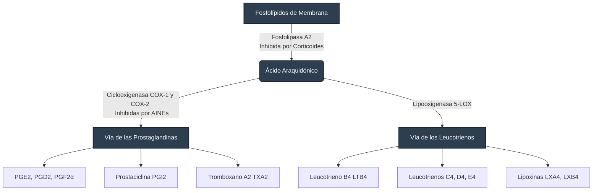
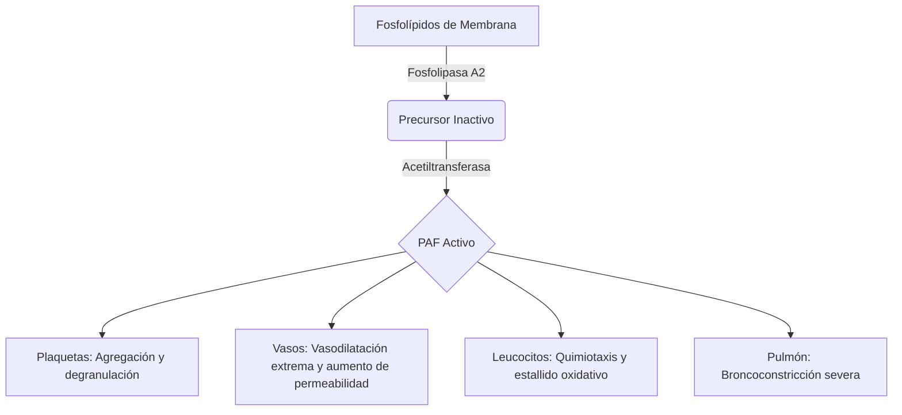

La visión general del bloque se divide en dos grandes ejes temáticos:

### 1. Clínica Quirúrgica
Esta unidad abarca todo el proceso de gestión del paciente desde una perspectiva clínica:
* **Evaluación y Riesgo (Preoperatorio):** Se enfoca en la capacidad diagnóstica para predecir complicaciones. Estratificar el riesgo mediante escalas (como la ASA) y decidir si el paciente está en condiciones óptimas para el estrés quirúrgico.
* **Soporte Vital y Control (Anestesia e Intubación):** Comprende el manejo farmacológico y la protección de la vía aérea. Aquí el enfoque es la estabilidad hemodinámica y la seguridad del paciente bajo el efecto de agentes externos.
* **Gestión del Evento (Trans y Posoperatorio):** Incluye la vigilancia continua y la detección temprana de desviaciones de la normalidad. La parte crítica aquí es el manejo de **líquidos y electrolitos**, que es puro razonamiento fisiológico para mantener la homeostasis.

### 2. Bases Moleculares
* **Respuesta Metabólica al Trauma:** Es el estudio de cómo el organismo interpreta la cirugía como una agresión. Analizamos la cascada neuroendocrina (hormonas y citoquinas) que altera el metabolismo para intentar sobrevivir al insulto quirúrgico.
* **Inflamación:** Se estudia como un mecanismo de defensa y reparación. Comprender la química de los mediadores y cómo estos procesos determinan si una herida sanará bien o si el paciente entrará en una respuesta sistémica descontrolada.

# Anestesia

## Historia
El desarrollo de la anestesia marcó la transición entre la cirugía como un acto de tortura y la cirugía como una intervención médica. Todo comenzó a mediados del siglo diecinueve. Aunque Crawford Long usó éter sulfúrico por primera vez en 1842, el crédito histórico y mediático suele otorgarse a William T.G. Morton, quien realizó la primera demostración pública exitosa de anestesia con éter en 1846, en el famoso "Ether Dome" del Hospital General de Massachusetts. Poco antes, Horace Wells había intentado algo similar con óxido nitroso, pero fracasó en su demostración pública, lo que lo llevó al descrédito. Posteriormente, figuras como John Snow comenzaron a aplicar métodos estadísticos y epidemiológicos para calcular las dosis de cloroformo, convirtiéndose de facto en los primeros especialistas en anestesiología y sacando a la disciplina del empirismo.

## Clasificación
La anestesia se clasifica fundamentalmente por la extensión de su efecto en el sistema nervioso. La anestesia general induce un estado reversible de inconsciencia, amnesia, analgesia e inmovilidad, afectando a todo el sistema nervioso central. Esta puede ser inhalatoria, intravenosa total o balanceada, que es la combinación de ambas para minimizar dosis y toxicidad. Por otro lado, la anestesia regional bloquea la transmisión del dolor en una zona extensa del cuerpo sin afectar el estado de alerta del paciente. Esta incluye los bloqueos neuroaxiales, como la anestesia epidural y la subaracnoidea, así como los bloqueos de plexos nerviosos periféricos. Finalmente, la anestesia local se limita a la infiltración directa de fármacos en un área muy pequeña y específica del tejido celular subcutáneo, bloqueando los canales de sodio de las terminaciones nerviosas superficiales.

## Farmacodinamia de los anestésicos
A nivel molecular, la mayoría de los anestésicos inhalados e intravenosos como el propofol actúan potenciando la transmisión inhibitoria a través de los receptores GABA-A en el sistema nervioso central, mientras que otros agentes como la ketamina bloquean los receptores excitatorios NMDA. Estos fármacos inducen una profunda alteración en la integración de la información cerebral, desconectando funcionalmente las redes tálamo-corticales y córtico-corticales. Al desmantelar esta sincronización de alta frecuencia, el cerebro pierde su capacidad de generar y sostener el procesamiento predictivo continuo del entorno y del propio cuerpo, colapsando el estado consciente a pesar de que las neuronas individuales continúan metabólicamente activas.

## Planos anestésicos
La evaluación clínica de la profundidad anestésica se basó durante décadas en la clásica clasificación de Arthur Guedel, descrita originalmente para la administración de éter a goteo abierto. Guedel dividió la anestesia en cuatro etapas. 
La etapa uno corresponde a la analgesia y amnesia iniciales, donde el paciente aún responde a comandos. 
La etapa dos, conocida como excitación o delirio, es una fase crítica y peligrosa caracterizada por hiperactividad simpática, respiración irregular y un altísimo riesgo de laringoespasmo o vómito. 
La etapa tres es la anestesia quirúrgica propiamente dicha, donde se deprimen los reflejos somáticos y autonómicos, permitiendo la incisión; esta etapa se subdivide en cuatro planos según la relajación muscular y el cese de los movimientos oculares. 
Finalmente, la etapa cuatro representa la parálisis bulbar, una sobredosis letal con colapso cardiovascular y paro respiratorio. En la práctica clínica moderna, la inducción rápida con fármacos intravenosos permite saltar la peligrosa etapa dos en cuestión de segundos, llevando al paciente directamente al plano quirúrgico seguro.

## Regulaciones ASA y Riesgo anestésico
Para estratificar la morbilidad y mortalidad perioperatoria, la American Society of Anesthesiologists diseñó el sistema de clasificación física ASA. 
El estado ASA I corresponde a un paciente completamente sano, sin enfermedades agudas o crónicas. 
El ASA II engloba a pacientes con enfermedad sistémica leve que está bien controlada y no causa limitación funcional, incluyendo a fumadores activos, bebedores sociales, embarazadas sanas o pacientes con hipertensión bien controlada. 
El ASA III indica una enfermedad sistémica grave con limitación funcional definitiva, como una diabetes mellitus descompensada, obesidad mórbida o antecedentes de infarto miocárdico de más de tres meses.

Avanzando en la escala, el grado ASA IV describe a un paciente con una enfermedad sistémica grave que representa una amenaza constante para la vida, lo que incluye insuficiencia cardíaca severa, sepsis o un infarto reciente de menos de tres meses. 
El nivel ASA V se reserva para el paciente moribundo cuya supervivencia no se espera más allá de veinticuatro horas sin la intervención quirúrgica, siendo el ejemplo clásico la ruptura de un aneurisma aórtico abdominal. 
Por último, el ASA VI se asigna exclusivamente al paciente con muerte encefálica declarada que será sometido a la extracción de órganos para donación. Además, si cualquier intervención debe realizarse de emergencia sin el tiempo adecuado de preparación, se añade el sufijo "E" a la categoría correspondiente, lo cual incrementa estadísticamente el riesgo global.

## Sistemas anestésicos
Los sistemas anestésicos son los circuitos de soporte vital que permiten entregar oxígeno y gases halogenados al paciente mientras se elimina el dióxido de carbono exhalado. Estos sistemas se conectan a la máquina de anestesia, un equipo electromédico complejo equipado con vaporizadores de precisión, flujómetros y monitores de presión. Los circuitos se clasifican según la reutilización de los gases expirados. Un sistema abierto no tiene reservorio y el paciente inhala anestésico directamente mezclado con el aire ambiental, un método obsoleto. El sistema semiabierto utiliza un reservorio y altos flujos de gas fresco para barrer el dióxido de carbono, evitando que el paciente lo reinhale, como en los circuitos de Mapleson. Finalmente, el sistema cerrado o semicerrado es el estándar moderno en los quirófanos; este circuito incorpora un recipiente con cal sodada que absorbe químicamente el dióxido de carbono de la exhalación del paciente, permitiendo que los gases anestésicos residuales y el oxígeno sean reutilizados de manera segura, conservando el calor, la humedad de la vía aérea y reduciendo drásticamente la contaminación ambiental del quirófano.

# Laringoscopia e Intubación Orotraqueal
El equipo básico incluye un laringoscopio con hojas intercambiables, siendo la curva o Macintosh la más común para adultos y la recta o Miller preferida en anatomías complejas o pacientes pediátricos. Se requiere también un tubo endotraqueal con neumotaponamiento, una guía metálica o fiador, una jeringa para inflar el globo, aspirador funcional y un dispositivo bolsa-válvula-mascarilla conectado a oxígeno. 

La técnica comienza colocando al paciente en posición de olfateo para alinear los ejes oral, faríngeo y laríngeo. Tras preoxigenar, se introduce la hoja del laringoscopio por la comisura labial derecha, desplazando la lengua hacia la izquierda. Con la hoja curva, la punta se coloca en la valécula, y el movimiento clave es una tracción firme hacia arriba y adelante, evitando estrictamente hacer palanca contra los incisivos superiores. Al visualizar las cuerdas vocales, se desliza el tubo, se infla el globo y se corrobora la posición mediante auscultación de epigastrio y campos pulmonares, aunque la capnografía es el estándar de oro confirmatorio.

Para anticipar una vía aérea complicada, la valoración clínica preoperatoria se apoya en escalas anatómicas clave. La escala de Mallampati evalúa las estructuras faríngeas visibles con el paciente sentado y la boca abierta; el grado uno permite ver úvula, pilares y paladar blando, mientras que el grado cuatro solo muestra el paladar duro, pronosticando gran dificultad. La distancia tiromentoniana, o escala de Patil-Aldreti, mide el espacio anterior del cuello; una distancia menor a seis centímetros, o menos de tres traveses de dedo, indica alto riesgo. La apertura bucal menor a tres centímetros también es una señal de alarma anatómica. Una vez iniciada la laringoscopia, se utiliza la escala de Cormack-Lehane para graduar la vista de la glotis; el grado uno muestra la apertura glótica completa, pero un grado cuatro no permite visualizar ni la epiglotis, convirtiendo el procedimiento en un escenario crítico que puede requerir dispositivos supraglóticos o mascarilla laríngea.

Las complicaciones del manejo de la vía aérea abarcan traumas mecánicos directos y respuestas fisiológicas adversas. La intubación esofágica inadvertida es la complicación más letal por la hipoxia fulminante que genera. El trauma dental y las laceraciones labiales o faríngeas son los daños mecánicos más comunes, derivados casi siempre del error de usar los dientes superiores como punto de apoyo. La broncoaspiración de contenido gástrico es un riesgo mayor en cirugías de urgencia donde el paciente no cumple con el ayuno preoperatorio. A nivel autonómico, la estimulación mecánica de la glotis puede desencadenar un laringoespasmo o un fuerte reflejo vagal, manifestándose como bradicardia extrema o arritmias. Por último, si el tubo se introduce demasiado, suele irse hacia la derecha por la anatomía del árbol traqueobronquial, causando una intubación selectiva del bronquio principal derecho que deja al pulmón izquierdo colapsado y sin ventilación.

# Proceso operatorio

## Preoperatorio
La historia clínica preoperatoria debe ir directo a buscar alergias, complicaciones en cirugías previas, antecedentes de sangrado anormal familiar y la hora exacta del último alimento para confirmar el ayuno seguro. Es vital rastrear el uso de medicamentos crónicos, suspendiendo a tiempo anticoagulantes y ajustando dosis de hipoglucemiantes, además de documentar los predictores anatómicos de vía aérea difícil. En la práctica real, los estudios de laboratorio que le pides a todos incluyen la biometría hemática para descartar anemia severa o infección activa, una química sanguínea básica para vigilar la glucosa y la función renal, tiempos de coagulación y grupo sanguíneo con Rh. Si es mujer en edad fértil, es una regla de oro pedir prueba de embarazo. Para los estudios de gabinete, la radiografía de tórax y el electrocardiograma se solicitan de cajón en todo paciente mayor de 40 años o en menores con enfermedades cardiopulmonares de base. El riesgo quirúrgico sirve para predecir morbilidad usando escalas como el Índice Revisado de Riesgo Cardíaco de Lee o la escala de Caprini para riesgo de trombosis. 
Básicamente, tú no operas (y cancelas la cirugía electiva) si el paciente presenta un infarto agudo al miocardio reciente, insuficiencia cardíaca descompensada, arritmias letales inestables, cetoacidosis diabética activa o una coagulopatía severa sin revertir.

## Transoperatorio
El monitoreo quirúrgico estándar exige tener siempre a la vista el electrocardiograma continuo, la oximetría de pulso, la presión arterial (no invasiva o invasiva según la gravedad), la temperatura central y la medición estricta de la uresis con sonda. Sumado a esto, la capnografía es innegociable, ya que es el estándar de oro para confirmar la correcta ventilación. Las posiciones quirúrgicas facilitan la exposición, pero traen riesgos propios; el decúbito supino es el más noble, la posición de Trendelenburg (cabeza abajo) es genial para cirugía pélvica pero aumenta la presión intracraneal y dificulta que los pulmones se expandan, la posición en prono requiere protección extrema de las zonas de presión faciales y oculares, y la de litotomía (piernas en estribos) tiene el clásico riesgo de lesionar el nervio peroneo si se prolonga. Las complicaciones transoperatorias más urgentes que debes vigilar incluyen la hemorragia aguda y el choque hipovolémico, arritmias inducidas por tracción de vísceras o fármacos, y la hipotermia, que altera cascadas de coagulación y favorece el sangrado.

## Posoperatorio
Cuidar a un paciente posquirúrgico depende de cómo escribes tus indicaciones para enfermería, las cuales siempre deben llevar un orden lógico y universal. Primero indicas la dieta, ya sea mantener el ayuno hasta que haya peristalsis o iniciar progresión a líquidos claros. Segundo, pautas las soluciones parenterales calculando los requerimientos basales de líquidos y reponiendo el sangrado o fluidos perdidos en quirófano. Tercero, escribes los medicamentos, asegurando un esquema de analgesia escalonada, antieméticos para evitar que el paciente vomite y lastime la herida, y los antibióticos, siempre anotando la presentación, dosis exacta, vía y horario. Cuarto, detallas las medidas generales, donde instruyes cada cuánto tomar signos vitales, los cuidados de la herida quirúrgica, la cuantificación de drenajes, los cuidados de sondas y la indicación de levantarse y caminar lo antes posible para evitar trombos. Finalmente, para predecir las complicaciones postoperatorias, debes buscar las famosas causas de fiebre aguda: atelectasias pulmonares en las primeras 48 horas, infecciones urinarias asociadas a la sonda, infecciones del sitio quirúrgico hacia el quinto o séptimo día, y el riesgo latente de trombosis venosa profunda. Además de la fiebre, debes vigilar estrictamente que la herida no presente sangrado activo o dehiscencia de suturas y que los intestinos despierten, evitando un íleo paralítico prolongado.

# Líquidos y electrolitos

## Desequilibrio Ácido-Base

Los desequilibrios ácido-base son alteraciones en la concentración de hidrogeniones en la sangre, dictados por los pulmones (manejando el $CO_2$) y los riñones (manejando el $HCO_3^-$). El pH normal es de **7.35 a 7.45**. 

* **Cómo identificarlos (La regla de 3 pasos):**
    1.  **Mira el pH:** ¿Es acidosis (< 7.35) o alcalosis (> 7.45)?
    2.  **Busca al culpable:** Si el pH es ácido y el $CO_2$ está alto (> 45 mmHg), es **respiratoria**. Si el pH es ácido y el $HCO_3^-$ está bajo (< 22 mEq/L), es **metabólica**. (Y viceversa para la alcalosis).
    3.  **Revisa la compensación:** El cuerpo siempre intenta compensar con el sistema opuesto. Si es acidosis metabólica, el paciente hiperventila para bajar el $CO_2$. Si la compensación no es la esperada matemáticamente, estás ante un trastorno mixto.
* **El Anion Gap (Brecha Aniónica):** Solo se calcula en la **acidosis metabólica**. Sirve para saber si la acidosis es por ganancia de ácidos (como ácido láctico o cetoácidos) o por pérdida de bicarbonato (como diarrea). 
La fórmula es:
    **$AG = Na^+ - (Cl^- + HCO_3^-)$**
    * **Anion Gap Normal (8 a 12 mEq/L):** Acidosis hiperclorémica. Se perdió bicarbonato (diarrea, fístulas biliares, acidosis tubular renal) y el cuerpo retuvo cloro para compensar la carga.
    * **Anion Gap Elevado (> 12 mEq/L):** Hay un "ácido fantasma" sumando carga. Nemotecnia MUDPILES (Metanol, Uremia, Cetoacidosis Diabética, Propilenglicol, Infección/Isoniazida, Ácido Láctico, Etilenglicol, Salicilatos). En cirugía general, **el lactato por choque o isquemia intestinal** es la causa número uno.
* **Trastornos Mixtos:** Ocurren cuando hay dos o más alteraciones primarias simultáneas. Ejemplo clásico de pase de visita: Paciente con sepsis abdominal (acidosis metabólica por lactato) que además está vomitando sin parar (alcalosis metabólica por pérdida de $HCl$ del estómago). El pH puede salir "normal", pero el bicarbonato y el $CO_2$ estarán por las nubes o por los suelos, y el Anion Gap estará alterado.

## Líquidos, Electrolitos y Nutrición

En cirugía el manejo consiste en cómo mantener a un paciente vivo y sin desnutrirse mientras no puede comer. Esto se calcula por kilogramo de peso al día (kg/día).

**1. Requerimientos Basales Diarios**
* **Agua:** **30 a 35 ml/kg/día**. (Para un paciente de 70 kg = ~2100 a 2500 ml al día).
* **Sodio ($Na^+$):** **1 a 2 mEq/kg/día**. 
* **Potasio ($K^+$):** **1 a 2 mEq/kg/día**. *(Si está bajo, el paciente hará íleo paralítico y sus intestinos no se moverán).*

**2. Macronutrientes:**
Si el paciente estará en ayuno prolongado (> 5-7 días), debes considerar Nutrición Parenteral Total (NPT). Sus requerimientos basales son:
* **Glucosa:** **2 a 3 g/kg/día**. (El cerebro humano obliga a un mínimo de 100-150 g al día para evitar que el cuerpo empiece a destruir músculo para hacer gluconeogénesis).
* **Aminoácidos:** **1 a 1.5 g/kg/día**. (En pacientes postraumáticos, sépticos o quemados graves, el catabolismo es altísimo y puede subir hasta **2 g/kg/día** para que la herida quirúrgica pueda cicatrizar).
* **Lípidos:** **1 g/kg/día**. (Aportan muchas calorías en poco volumen y previenen la deficiencia de ácidos grasos esenciales).

**3. Cómo reponerlos e indicarlos en piso:**
Si un paciente de 70 kg necesita ~2100 ml de agua y sus electrolitos basales, no le pones agua pura (causarías hemólisis). Usas soluciones cristaloides:
* **Solución Salina al 0.9% (Fisiológica):** Tiene 154 mEq de Sodio y 154 mEq de Cloro. Cuidado: su exceso causa acidosis hiperclorémica (porque tiene más cloro que la sangre).
* **Solución Hartman (Ringer Lactato):** Se parece más al plasma. Tiene Sodio, Potasio, Calcio y Lactato (que el hígado convierte en bicarbonato). Ideal para reponer pérdidas en quirófano.
* **Solución Glucosada al 5%:** Aporta solo agua libre y 50 gramos de glucosa por litro (unas 200 calorías). No sirve para reanimar si el paciente está sangrando, pero sirve para cubrir requerimientos calóricos básicos.

**Ejemplo de indicación en expediente:**
*"Solución Mixta (Glucosada 5% + Salina 0.9%) 1000 cc + 20 mEq de Cloruro de Potasio (KCl) para pasar vía intravenosa cada 8 horas."* *(Esto le pasará 3 litros en 24 horas, aportándole 150g de glucosa, cubriendo sus necesidades de sodio y aportándole 60 mEq de potasio. Un esquema perfecto de mantenimiento).*

# Inflamación

# Respuesta Metabólica al Trauma (RMT)

Para entender todo el bloque, necesitas conocer las **Fases de Cuthbertson**. Sir David Cuthbertson fue un bioquímico escocés que en la década de 1930 se dio cuenta de que el cuerpo humano no reacciona al trauma de una sola manera, sino que atraviesa fases secuenciales muy distintas para sobrevivir.
Para fines de simplificación (y para entender a tu paciente en el hospital), la RMT se divide clásicamente en dos fases principales, más una tercera de recuperación:

1. Fase Ebb (Fase de Reflujo, Choque o Hipodinámica)
Es la fase de supervivencia extrema. Ocurre inmediatamente después del corte o accidente y dura horas (típicamente de 12 a 24 horas).

El objetivo: Conservar el volumen sanguíneo y proteger los órganos vitales (cerebro y corazón).

¿Qué le pasa al paciente? Todo disminuye.

* Cae el gasto cardíaco (hipoperfusión).

* Disminuye el consumo de oxígeno.

* Baja la temperatura corporal (hipotermia).

* Disminuye la tasa metabólica basal.

Hay una liberación masiva de catecolaminas para hacer vasoconstricción y tratar de mantener la presión arterial.

2. Fase Flow (Fase de Flujo o Hiperdinámica)
Una vez que el paciente sobrevive al choque inicial (o es reanimado con líquidos por el cirujano), el cuerpo se da cuenta de que no va a morir desangrado y cambia de estrategia. Comienza la fase de reparación, que dura días o semanas.

El objetivo: Reparar el daño, cicatrizar la herida y combatir posibles infecciones.

¿Qué le pasa al paciente? Todo se acelera a niveles tóxicos. Es la fase del hipermetabolismo y el hipercatabolismo.

* Aumenta el gasto cardíaco.

* Aumenta drásticamente el consumo de oxígeno.

* Sube la temperatura (fiebre postoperatoria).

Para sacar la energía necesaria para curar la herida, el cuerpo destruye sus propias proteínas (músculo) y grasas. Aquí es donde ocurre la resistencia a la insulina, la hiperglucemia y la pérdida de peso brutal de pacientes de terapia intensiva.

3. Fase Anabólica (Fase de Convalecencia)
Algunos autores la incluyen como la etapa final de la Fase Flow. Ocurre semanas o meses después.

El objetivo: Reconstruir lo que se destruyó.

¿Qué le pasa al paciente? Las hormonas del estrés por fin bajan. Vuelve a hacer efecto la insulina. El paciente recupera el apetito (vuelve el peristaltismo al cien), se detiene la pérdida de músculo y comienza a ganar peso lentamente, hay un balance de nitrógeno positivo y se restaura la grasa corporal.

Cuando tienes a un paciente recién operado o accidentado en Urgencias, tu trabajo es sacarlo vivo de la Fase Ebb (poniéndole líquidos, sangre, tapando la hemorragia) para que su cuerpo pueda entrar a la Fase Flow y hacer su magia de cicatrización.

## Catabolismo relacionado a cirugía
El cuerpo percibe el corte del bisturí y reacciona activando el sistema nervioso simpático y el eje hipotálamo-hipófisis-suprarrenal. 
*   **El objetivo:** Movilizar sustratos (destruir tejido) para darle energía al cerebro, al corazón y a la herida que está sanando. 
*   **El mecanismo (Las hormonas contrarreguladoras):** Se liberan masivamente **Catecolaminas** (adrenalina/noradrenalina), **Cortisol** y **Glucagón**. 
*   Estas hormonas bloquean la acción de la insulina. Por eso, **todo paciente postoperado tiene resistencia a la insulina transitoria** y hace hiperglucemia (incluso si no es diabético).

## Cambios en las Fuentes Energéticas
Normalmente, el cuerpo usa la glucosa de lo que comes. En el postoperatorio (ayuno + estrés), las prioridades cambian:
1.  **Carbohidratos (Hígado):** Las reservas de glucógeno hepático se agotan en 12 a 24 horas. El hígado empieza a hacer gluconeogénesis masiva.
2.  **Lípidos (Tejido adiposo):** Se activa la lipólisis. Los triglicéridos se rompen en ácidos grasos libres (para darle energía a los músculos) y glicerol (para que el hígado haga más glucosa).
3.  **Proteínas (Músculo):** El cuerpo canibaliza el músculo esquelético (proteólisis) para liberar aminoácidos, especialmente **alanina y glutamina**. La glutamina es el alimento principal de los enterocitos y del sistema inmune.

## Hipermetabolismo postraumático
El metabolismo basal (Gasto Energético de Reposo) se dispara. 
*   En una cirugía electiva normal, el metabolismo sube un 10-15%.
*   En un politrauma o sepsis grave, sube un 50%.
*   En un paciente con quemaduras graves (>40% del cuerpo), el metabolismo **se duplica (100%)**.
*   **Clínica:** El paciente consume más oxígeno, produce más $CO_2$, está taquicárdico y aumenta su temperatura corporal. Por esto, los requerimientos nutricionales deben ajustarse hacia arriba si el paciente está muy grave.

## Citosinas y Respuesta Metabólica
Las citosinas son los mensajeros del sistema inmune. Los macrófagos detectan el tejido cortado y las liberan a la sangre. Tienes que memorizar estas tres proinflamatorias:
*   **Interleucina-1 (IL-1):** Es el pirógeno endógeno principal. Produce la **fiebre** postoperatoria no infecciosa.
*   **Interleucina-6 (IL-6):** Es el principal estimulador para que el hígado produzca las Proteínas de Fase Aguda (como la **Proteína C Reactiva - PCR**). Su nivel en sangre es directamente proporcional a la gravedad del trauma quirúrgico.
*   **Factor de Necrosis Tumoral alfa (TNF-α):** Causa anorexia, caquexia y es el principal culpable del choque vasodilatador en la sepsis.
*   La **IL-10** es la antiinflamatoria (la que intenta apagar el incendio para que el paciente no muera por inflamación sistémica).

## Energía de fluidos, elasticidad, viscosidad, flujo laminar, turbulencia y resistencia
*   **Viscosidad:** Es la resistencia interna de un líquido. La sangre es viscosa por los eritrocitos (hematocrito). Si pasas mucha solución salina, hemodiluyes la sangre, baja la viscosidad y el corazón bombea más fácil, pero transportas menos oxígeno.
*   **Flujo Laminar vs. Turbulento:**
    *   *Laminar:* La sangre viaja en capas ordenadas. Es silencioso y normal.
    *   *Turbulento:* Caótico, hace remolinos. Ocurre cuando hay placas de colesterol o al bifurcarse las arterias. Es lo que escuchas al poner el estetoscopio (soplos).
*   **Resistencia y la Ley de Poiseuille:** La resistencia de un tubo es inversamente proporcional a su radio elevado a la cuarta potencia ($r^4$). 
    *   Si duplicas el grosor de un catéter, el líquido pasa 16 veces más rápido Por eso, en un paciente desangrándose, **jamás** le pones un Catéter Venoso Central (que es largo y delgado). Le pones dos **catéteres periféricos cortos y gruesos (14G o 16G)** en los brazos para pasar volumen a chorro.

## Hemodinamia venosa
Las venas son el tinaco del cuerpo; almacenan el 65-70% de la volemia (vasos de capacitancia). 
La sangre sube contra la gravedad gracias a:
1.  Las válvulas venosas.
2.  La bomba muscular (los gemelos de la pierna exprimen las venas al caminar).
3.  La bomba respiratoria (al inspirar, creas presión negativa en el tórax que "chupa" la sangre hacia el corazón).
*   Cuando anestesias y paralizas a un paciente, anulas la bomba muscular. Y cuando lo intubas con presión positiva, anulas la bomba respiratoria. ¿Resultado? **El retorno venoso cae drásticamente y el paciente se hipotensa al inducir la anestesia.**

## Propedéutica Médica
La RMT se traduce en signos vitales y datos clínicos puros:
*   **Taquicardia y vasoconstricción:** Por la liberación de catecolaminas.
*   **Taquipnea:** Para compensar acidosis o por aumento del consumo de oxígeno.
*   **Fiebre leve (primeras 24-48h):** Por la IL-1, TNF-α y atelectasias pulmonares (no por infección de la herida, que tarda días en manifestarse).
*   **Oliguria (poca orina):** Por la liberación de ADH y Aldosterona. El cuerpo retiene agua y sodio para defender la presión arterial.
*   **Íleo paralítico:** Los intestinos dejan de moverse temporalmente por la descarga simpática extrema.

# Inflamación

## Concepto y fisiopatología

La inflamación es una respuesta protectora (vascular y celular) del tejido vivo vascularizado ante una lesión. Su objetivo es aislar y destruir al agente agresor, además de preparar el terreno para la cicatrización. 

**Fisiopatología:**

1.  **Cambios Vasculares:** Tras una lesión, hay una vasoconstricción fugaz (segundos), seguida inmediatamente de una **vasodilatación masiva** (causada por histamina y óxido nítrico). Esto abre los capilares, causando enlentecimiento del flujo (estasis) y aumento de la permeabilidad vascular. El líquido rico en proteínas escapa al espacio intersticial (edema).
2.  **Reclutamiento Celular (La Diapédesis):** Las células blancas tienen que salir de la sangre al tejido dañado. Esto ocurre en 4 pasos precisos:
    *   *Marginación y Rodamiento:* Los leucocitos se pegan débilmente al endotelio usando **Selectinas**.
    *   *Adhesión firme:* Se anclan fuertemente gracias a las **Integrinas**.
    *   *Transmigración (Diapédesis propiamente dicha):* Las células exprimen su cuerpo a través de las uniones endoteliales guiadas por la molécula **PECAM-1 (CD31)**.
    *   *Quimiotaxis:* Nadan hacia el sitio del daño siguiendo el rastro químico (IL-8, C5a, Leucotrieno B4 y productos bacterianos).
3.  **Los Actores:**
    *   **Los Neutrófilos (PMN):** Son las fuerzas especiales de choque. **Llegan primero (en las primeras 6 a 24 horas)**. Matan bacterias, pero tienen vida corta; a las 24-48 horas sufren apoptosis (mueren) y forman el pus.
    *   **Los Macrófagos:** Llegan en la segunda oleada (a partir de las 48 a 96 horas). Fagocitan a los neutrófilos muertos y a dan la orden para que empiece la reparación.

## Fase exudativa y de reparación

**1. Fase Exudativa:**
*   **Propósito:** Diluir toxinas con líquido, formar una red de fibrina para atrapar al agresor y matar microbios con neutrófilos.
*   **A nivel MACRO:** Ves los famosos signos cardinales de Celso y Virchow: **Rubor** (rojez por vasodilatación), **Calor** (por aumento de flujo sanguíneo), **Tumor** (edema por el exudado), **Dolor** (la bradicinina y prostaglandinas irritan los nervios) y **Pérdida de la función**.
*   **A nivel MICRO:** Vasos dilatados, un intersticio inundado de **exudado** (líquido con muchas proteínas y células) y un enjambre de neutrófilos atacando.

**2. Fase de Reparación:**
*   Empieza a solaparse alrededor del **día 3 o 4**. El cambio ocurre cuando los macrófagos cambian su perfil químico: dejan de escupir citocinas destructivas (M1) y empiezan a secretar **TGF-β y VEGF** (perfil M2), que son las órdenes de construcción.
*   **A nivel MACRO:** El calor, rubor y tumor disminuyen drásticamente. En las heridas abiertas, empiezas a ver el tejido de granulación (es un tejido rosado, húmedo, blando y que sangra fácilmente si lo tocas).
*   **A nivel MICRO:** Hay dos fenómenos dominantes: **Angiogénesis** (creación de nuevos vasos sanguíneos microscópicos para llevar nutrientes) y **Proliferación de Fibroblastos** (células que empiezan a depositar colágeno para crear la cicatriz). Los neutrófilos ya desaparecieron.

## Patología y tipos de inflamación

La anatomía patológica clasifica a la inflamación aguda según el tipo de exudado que deja:

*   **Inflamación Serosa:** El líquido es acuoso y tiene pocas proteínas (transudado modificado). *Ejemplo: La ampolla de una quemadura de segundo grado superficial.*
*   **Inflamación Fibrinosa:** La lesión vascular es tan grande que escapan proteínas gigantes como el fibrinógeno. *Ejemplo: Pericarditis o pleuritis.* Si no se limpia, causa adherencias (sinequias) entre los órganos.
*   **Inflamación Purulenta (Supurativa):** Se caracteriza por la producción de pus (neutrófilos muertos, necrosis licuefactiva y líquido). Es casi siempre causada por bacterias piógenas como el estafilococo. *Ejemplo: Apendicitis aguda o abscesos.*
*   **Inflamación Ulcerosa:** Ocurre solo en superficies o mucosas, donde el tejido inflamado y necrótico se desprende, dejando un cráter. *Ejemplo: Úlcera péptica.*

## Inflamación aguda y la Temporalidad

*   **Aguda:** Es la respuesta inmediata. Clínicamente domina el edema y los neutrófilos. En tiempos estrictos, **dura desde los primeros minutos hasta los 4 a 7 días (una semana)**. Si a los 4 días el paciente sigue con los picos de inflamación al máximo, algo está mal (posible infección agregada).
*   **Subaguda:** Es la "zona gris" temporal y clínica. Se considera subaguda aquella que dura **desde la primera semana (día 7) hasta las 4 a 6 semanas**. A nivel celular, los macrófagos y los primeros linfocitos están dominando, pero aún hay signos clínicos de actividad inflamatoria.
*   **Crónica:** El Colegio y los consensos quirúrgicos marcan la frontera de la cronicidad en **más de 6 semanas**. Puede durar meses o años. 
    *   Aquí ya no hay edema ni neutrófilos. Hay macrófagos, linfocitos y un intento excesivo de reparación que termina en **fibrosis** (cicatrices duras o retráctiles) y destrucción tisular continua. Es el clásico paciente con una fístula o un cuerpo extraño retenido (como una gasa olvidada).

## Mediadores químicos de la inflamación

Los mediadores químicos son las señales que encienden, amplifican o apagan la respuesta inflamatoria. Pueden derivar del plasma (como el sistema del complemento o la coagulación) o de las células.

### Metabolitos del Ácido Araquidónico (Eicosanoides)
El ácido araquidónico es un ácido graso de 20 carbonos que vive escondido en los fosfolípidos de las membranas celulares. Cuando hay trauma, la enzima **Fosfolipasa A2** lo libera, y de ahí puede tomar dos caminos metabólicos.

*   **Vía de la Ciclooxigenasa (COX):**
    *   **Prostaglandinas (PGE2, PGD2):** Son las reinas del **dolor y la fiebre**. Causan vasodilatación masiva. Por eso damos AINEs (Ketorolaco, Ibuprofeno), porque bloquean a la COX y apagan esta vía.
    *   **Tromboxano A2 (TXA2):** Producido por las plaquetas. Hace vasoconstricción y promueve la **agregación plaquetaria** (forma el tapón inicial).
    *   **Prostaciclina (PGI2):** Producida por el endotelio sano. Hace exactamente lo contrario al Tromboxano: vasodilata e impide que las plaquetas se peguen donde no deben.
*   **Vía de la Lipooxigenasa (LOX):**
    *   **LTB4:** Hace **quimiotaxis** pura, atrayendo a los neutrófilos al sitio de la herida.
    *   **LTC4, LTD4, LTE4:** Causan broncoconstricción extrema y aumentan la permeabilidad vascular mucho más que la histamina.
    *   **Lipoxinas:** Son la excepción a la regla. Son **antiinflamatorias**; se activan tarde para detener a los neutrófilos y empezar a resolver la inflamación.

#### 2. Factor Activador de Plaquetas (PAF)
El PAF también deriva de los fosfolípidos de membrana, pero tiene un poder de 100 a 10,000 veces mayor que la histamina para causar dilatación vascular y fuga de líquidos.

#### 3. Citocinas y Quimiocinas
Las citocinas son proteínas secretadas por células, principalmente macrófagos y linfocitos, que modulan la función de otras células. Las quimiocinas son una subfamilia diseñada exclusivamente para la quimiotaxis.

| Mediador | Fuente Principal | Función Principal |
| :--- | :--- | :--- |
| **TNF-α (Factor de Necrosis Tumoral)** | Macrófagos | Activación endotelial. Induce fiebre, anorexia y caquexia. Culpable del choque séptico. |
| **IL-1 (Interleucina 1)** | Macrófagos | Hermana del TNF. Principal pirógeno endógeno (**Fiebre** postoperatoria). Activa fibroblastos. |
| **IL-6 (Interleucina 6)** | Macrófagos, células T | Estimula al hígado para producir **Proteínas de Fase Aguda** (PCR, fibrinógeno). |
| **IL-10 y TGF-β** | Macrófagos M2, Treg | **Antiinflamatorias.** Apagan la respuesta inmune y el TGF-β inicia la fibrosis/cicatrización. |
| **IL-8 (CXCL8) - *Quimiocina*** | Macrófagos, Endotelio | El principal quimioatrayente exclusivo para **Neutrófilos**. |

---

## Patrones morfológicos de la inflamación aguda y crónica

La forma en que se ve el tejido al microscopio y a simple vista, nos dice exactamente en qué fase del proceso estamos. 

#### Patrones de Inflamación Aguda
Se caracterizan por alteraciones vasculares, edema y predominio absoluto de neutrófilos.
1.  **Serosa:** Acumulación de líquido pobre en células (transudado o exudado muy leve). Ejemplo: Ampollas cutáneas por quemaduras térmicas en cirugía de trauma.
2.  **Fibrinosa:** Daño vascular severo que deja escapar fibrinógeno, formando una red de fibrina gruesa. Clínicamente relevante en cavidades (pleura, pericardio, peritoneo). Si no se limpia, los fibroblastos la colonizan y se forman **adherencias quirúrgicas** o bridas.
3.  **Supurativa o Purulenta:** Presencia masiva de pus (neutrófilos muertos y bacterias). Ejemplo: Apendicitis aguda abscedada.
4.  **Ulcerosa:** Excavación local en la superficie de un órgano o mucosa por necrosis y desprendimiento del tejido inflamado.

#### Patrones de Inflamación Crónica
Se caracteriza por tres elementos simultáneos: **Infiltrado mononuclear** (macrófagos, linfocitos, células plasmáticas), **Destrucción tisular** (por la inflamación prolongada) e **Intentos de reparación** (proliferación de vasos sanguíneos y fibrosis). Se divide en dos grandes subtipos:

1.  **Crónica Inespecífica:**
    *   No hay un patrón celular especial, solo una combinación de macrófagos y linfocitos destruyendo y reparando al mismo tiempo, lo que genera paredes engrosadas y duras por la fibrosis.
    *   *Ejemplo quirúrgico:* La colecistitis crónica. La vesícula se vuelve una pared fibrosa y rígida por estar luchando contra los cálculos biliares durante años.
2.  **Crónica Granulomatosa:**
    *   El cuerpo no puede fagocitar ni destruir al agresor, así que decide encerrarlo.
    *   Forma un **granuloma**: una muralla formada por macrófagos modificados (células epitelioides) que a menudo se fusionan creando **células gigantes multinucleadas** (tipo Langhans), rodeados por un collar de linfocitos T.
    *   *Ejemplo quirúrgico:* Reacción a cuerpo extraño (cuando se deja un hilo de sutura de seda o catgut y el cuerpo forma un granuloma a su alrededor), o enfermedades infecciosas clásicas como la tuberculosis intestinal.